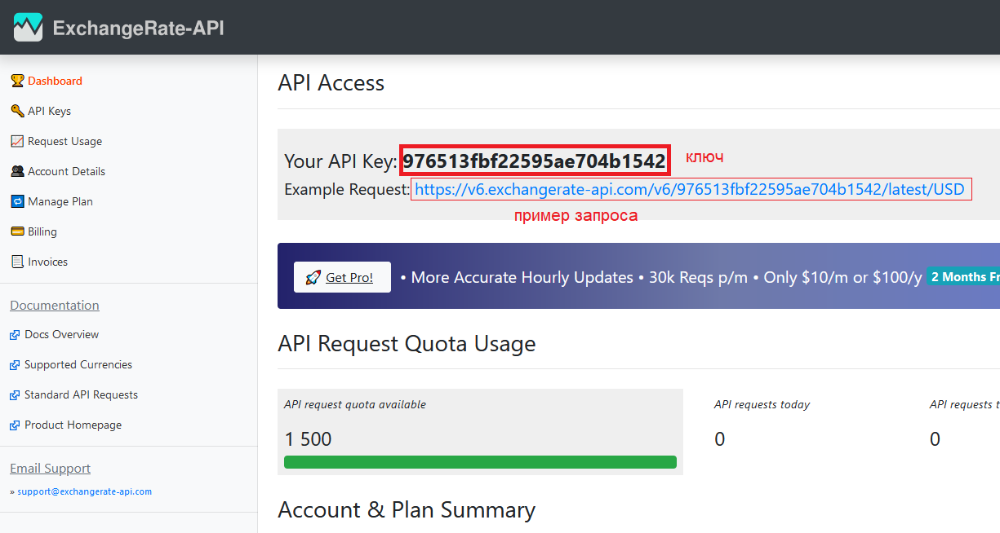
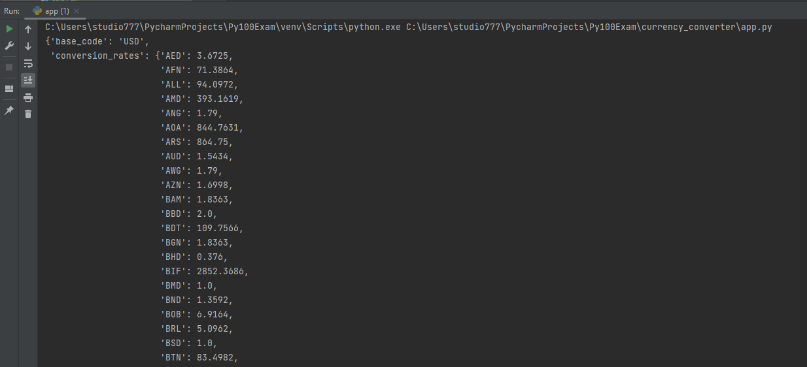

Конвертер валют

Для работы необходимо установить библиотеку `requests`

```python
pip install requests
```

Далее заходим на сайт и регистрируемся

https://app.exchangerate-api.com/sign-up

Получаем ключ

Можно пройти по ссылке посмотреть как будет выглядеть ответ на запрос



Для упрощения работы ниже приведен пример запроса на данный сайт

```python
import requests
import pprint

key = '976513fbf22595ae704b1542'
base_currency = 'USD'


url = f"https://v6.exchangerate-api.com/v6/{key}/latest/{base_currency}"
response = requests.get(url)
data = response.json()
pprint.pprint(data)
```

В переменной `data` содержится словарь, так как сервер возвращает `json`, а `response.json()` трансформирует json в словарь

А вот и результат



Техническое задание:

* Необходимо провести описание функции, её входных переменных и провести аннотацию входных и выходных переменных.

* При старте программы должна появиться приветственная надпись

* Программа проверяет есть ли у пользователя сохраненный ключ доступа на сайт в файле `key_access.txt`. Если он там есть,
то считывает значение и записывает в переменную `key`. Если файла нет, или он пустой, то просит пользователя ввести ключ доступа
, затем сохраняет его в переменной `key` и затем сохраняет в файле `key_access.txt`.

* Программа просит пользователя ввести `"Введите код исходной валюты (например, USD): "`

* Необходимо проверить если ли такая валюта среди допустимого кода из файла `currency.json`. Если нет, то вывести таблицу или список с допустимым кодом валюты

* Программа просит пользователя ввести `"Введите код целевой валюты (например, RUB): "`

* Необходимо проверить если ли такая валюта среди допустимого кода из файла `currency.json`. Если нет, то вывести таблицу или список с допустимым кодом валюты

* Программа просит ввести сумму для конвертации

* Проводятся валидации введенного значения, чтобы значение было числом больше 0. Если пользователь ввел вместо числа строку или недопустимое значение, 
то должно появиться сообщение о некорректном вводе и пользователь заново должен ввести данные для расчета.

* Результат расчета выводится на экран с двумя знаками после запятой, в формате: `За 1.00 USD получите 1.00 EUR`

В файле `app.py` реализуйте данное приложение.